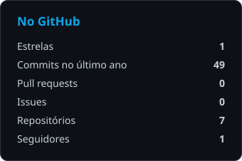
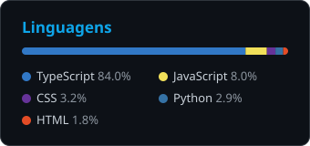

  

 

### Oi, eu sou o Caio

Na internet quase todo mundo me conhece como **CaioX**. Faço freela e projeto fechado, e a maior parte do que passou pela minha mão foi bot de Discord, loja online, painel administrativo ou API.

Gosto de pegar o projeto inteiro, da tela até o servidor, porque quando uma pessoa só cuida do layout, do auth, do banco e do deploy sobra bem menos ponta solta pra resolver depois. Antes de escrever a primeira linha eu combino o que entra, o que fica de fora e um prazo que dá pra cumprir de verdade.

<b>English version</b>

 

I go by CaioX online. I freelance on Discord bots, online stores, admin dashboards and APIs, and I usually own the whole thing, from the UI down to auth, the database and deploy. Scope and deadline get agreed on before any code gets written.

 

---

### Com o que eu trabalho

  

No front vai quase sempre Next.js com Tailwind. No back eu prefiro Fastify com Postgres, auth por cookie HttpOnly e proteção contra CSRF, e só coloco Redis quando o projeto realmente pede cache ou fila.

---

### Alguns projetos

<table>
<tr>
<td width="50%" valign="top">

#### 🛒 [Noturno Store](https://port-caiox.vercel.app/projetos/noturno-store)
E-commerce completo, com catálogo, carrinho, checkout, login e um painel admin pra quem cuida da loja.

`Next.js 16` `React 19` `Fastify` `Tailwind`

</td>
<td width="50%" valign="top">

#### 🎫 [Bot OAuth2 + Ticket](https://port-caiox.vercel.app/projetos/nxndo-oauth-ticket)
Bot de Discord que recupera membros do servidor via OAuth2 e abre ticket com atendimento por IA, guardando log de tudo que acontece.

`TypeScript` `discord.js` `Fastify`

</td>
</tr>
<tr>
<td width="50%" valign="top">

#### 📈 [Souza Vendas](https://port-caiox.vercel.app/projetos/souza-vendas)
Landing comercial montada pra converter visita em contato, com área logada por trás.

`Next.js` `React` `Tailwind` `Motion`

</td>
<td width="50%" valign="top">

#### 🤖 [AutoRoblox](https://port-caiox.vercel.app/projetos/autoroblox)
Automação de criação de contas com uma control room onde dá pra acompanhar cada execução em tempo real.

`Node` `Puppeteer` `API Roblox`

</td>
</tr>
</table>

Os prints e o contexto de cada um estão no [portfólio](https://port-caiox.vercel.app/). Aqui no GitHub ficam os repositórios que são públicos.

---

### Como costuma funcionar

A gente fecha escopo e prazo primeiro. Depois eu mando uma versão rodando o quanto antes, pra você mexer, achar o que não gostou e me falar enquanto ainda é barato mudar, e o resto vai saindo em partes até a entrega. A conversa rola pelo Discord ou por e-mail, e eu não sumo no meio do projeto.

Por enquanto trabalho só com freela e projeto fechado, sem CLT ou PJ.

---

 

Tem um projeto em mente? Me chama pelo [site](https://port-caiox.vercel.app/#contato) que eu respondo.

